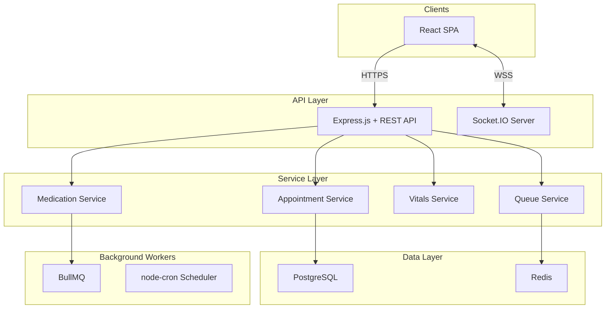

# SmartCare

A comprehensive care coordination platform that enables chronic disease patients, doctors, and caregivers to manage appointments, medications, and vitals in real time.
This project demonstrates system architecture, featuring real-time queue management, asynchronous background processing, and role-based access control built on a modern TypeScript stack.

Live demo: https://smart-care-theta.vercel.app/

---

## Table of Contents

- [Overview](#overview)
- [Features](#features)
- [Tech Stack](#tech-stack)
- [Architecture](#architecture)
- [Getting Started](#getting-started)
- [Environment Variables](#environment-variables)
- [Usage](#usage)
- [Engineering Decisions](#engineering-decisions)
- [Roadmap](#roadmap)
- [Author](#author)

---

## Overview

Managing chronic care involves complex coordination between patients, clinicians, and family caregivers. Traditional clinic workflows rely on disjointed systems, leading to poor medication adherence, opaque clinic wait times, and a lack of continuous health context between visits.

SmartCare solves this by providing a unified clinical portal. It bridges the gap between clinic visits by allowing patients to log daily vitals, track medication streaks, and share medical records securely. For clinics, it introduces a smart queue system that provides real-time token tracking and wait-time estimations, dramatically improving the patient waiting room experience.

Technically, the project explores the challenges of real-time state synchronization and distributed background processing. It leverages Socket.IO for live queue updates and BullMQ with Redis for fault-tolerant medication reminders and nightly analytics aggregation.

---

## Features

- **Smart Queue & Appointments** — Provides patients with live queue tokens and wait-time estimations, powered by WebSockets to synchronize clinic room states instantly.
- **Medication Engine** — Supports complex recurring schedules with automated reminders, allowing patients to mark doses as taken, skipped, or snoozed while tracking overall adherence.
- **Vitals Monitoring** — Enables continuous tracking of critical metrics such as blood pressure, glucose, and pulse, giving doctors a full historical picture rather than a single snapshot.
- **Caregiver Linkages** — Implements permission-based relationships, allowing authorized family members to view patient vitals, monitor medication adherence, and book appointments on their behalf.
- **Analytics & Reporting** — Precomputes nightly analytics snapshots to quickly render patient adherence rates, delayed doses, and medical streaks without heavy database aggregations.
- **Payment Integration** — Integrates with the Cashfree payment gateway for seamless appointment fee processing and status verification.
- **Medical Record Management** — Allows secure upload and storage of clinical documents and prescriptions using AWS S3.

---

## Tech Stack

**Frontend**

| Technology | Purpose |
|---|---|
| React 19 | Core UI library utilizing modern concurrent rendering |
| Vite | Lightning-fast build tooling and hot module replacement |
| TailwindCSS | Utility-first styling for building the proprietary design system |
| React Query | Server state synchronization, caching, and request deduping |
| Socket.IO Client | Real-time bidirectional communication for queue tokens |
| Chart.js | Visualizing longitudinal vital trends and adherence analytics |

**Backend**

| Technology | Purpose |
|---|---|
| Node.js & Express | High-performance, unopinionated API routing layer |
| TypeScript | End-to-end type safety across domain models and API contracts |
| Prisma ORM | Type-safe database queries and schema migration management |
| Socket.IO | Emitting real-time queue and status updates to connected clients |
| BullMQ & Redis | Robust, Redis-backed message queue for background jobs |
| JWT & bcryptjs | Stateless authentication and secure password hashing |

**Infrastructure / Tooling**

| Technology | Purpose |
|---|---|
| PostgreSQL | Primary relational datastore handling complex domain relationships |
| Redis | In-memory store for session caching and job queues |
| AWS S3 | Secure, scalable object storage for medical records |
| Brevo | Transactional email delivery for notifications and verifications |

---

## Architecture

SmartCare follows a modular, layered architecture designed for separation of concerns and scalability. The client applications (React SPA and mobile views) communicate with the backend via a RESTful Express API for standard CRUD operations and via Socket.IO for real-time events.

The backend is structured into controllers, services, and data access layers. Background workers independently process heavy tasks such as sending out scheduled medication reminders and generating nightly analytics snapshots. This ensures the main API thread remains unblocked and responsive.



### Database Schema Highlights
The database is heavily normalized to support the multi-role ecosystem. The `User` entity serves as the root for all authentication, branching into `DoctorProfile` for specific clinical metadata. `Appointment` records bridge patients and doctors, while the `QueueToken` model tracks the ephemeral, real-time waiting room state. Patient health is tracked via `Medicine`, `MedicationLog`, and `Vital` tables, linked dynamically to the patient.

---

## Getting Started

### Prerequisites

- Node.js v18 or higher
- PostgreSQL (running locally or via Docker)
- Redis (running locally or via Docker)

### Installation

```bash
# Clone the repository
git clone https://github.com/PLACEHOLDER_USERNAME/smartcare.git
cd smartcare

# Install backend dependencies
cd server
npm install

# Install frontend dependencies
cd ../client
npm install
```

### Set up environment variables

```bash
# In the server directory
cp .env.example .env

# In the client directory
cp .env.example .env
```

### Running Locally

```bash
# Terminal 1: Run PostgreSQL and Redis via Docker Compose
docker-compose up -d

# Terminal 2: Run backend database migrations and start the server
cd server
npm run db:migrate
npm run dev

# Terminal 3: Start the frontend development server
cd client
npm run dev
```

---

## Environment Variables

**Server (`server/.env`)**

| Variable | Required | Description |
|---|---|---|
| `DATABASE_URL` | Yes | PostgreSQL connection string |
| `REDIS_URL` | Yes | Redis connection string |
| `PORT` | Yes | API server port (default 4000) |
| `JWT_SECRET` | Yes | Secret key for signing auth tokens |
| `BREVO_API_KEY` | Yes | API key for transactional emails |
| `AWS_ACCESS_KEY_ID` | Yes | AWS credential for S3 uploads |
| `AWS_BUCKET_NAME` | Yes | S3 bucket name for medical records |
| `CASHFREE_CLIENT_ID` | Yes | Payment gateway client ID |

**Client (`client/.env`)**

| Variable | Required | Description |
|---|---|---|
| `VITE_API_URL` | Yes | Backend REST API base URL |
| `VITE_SOCKET_URL` | Yes | Backend WebSocket URL |

---

## Usage

1. **Patient Registration & Vitals**: A new patient signs up, verifies their email, and accesses the dashboard. They can immediately begin logging vitals such as blood pressure and glucose levels, which map to longitudinal charts.
2. **Booking an Appointment**: The patient navigates to the doctor search directory, selects an available slot from a doctor's availability matrix, and pays the consultation fee via the integrated Cashfree gateway.
3. **Smart Queue Tracking**: On the day of the appointment, the patient checks their dashboard to see their live queue token number and estimated wait time, updating in real-time as the doctor completes prior consultations.
4. **Caregiver Delegation**: The patient invites a family member via the caregiver portal. Once accepted, the caregiver can monitor the patient's medication adherence and upcoming appointments directly from their own isolated view.

---

## Engineering Decisions

### Real-time State via WebSockets over Polling
Managing a live clinic queue requires patients to know exactly when it is their turn to avoid crowding waiting rooms. Relying on standard HTTP polling would flood the server with requests and introduce latency. Implementing Socket.IO allows the backend to broadcast status changes (e.g., changing a QueueToken from WAITING to IN_PROGRESS) instantly to the specific patient's client, significantly reducing database load while providing a seamless user experience.

### Decoupled Background Processing with BullMQ
Medication adherence relies on timely reminders. Processing these reminders inline within the main application thread risked degrading API performance. By introducing BullMQ backed by Redis, the system queues thousands of notification jobs asynchronously. This ensures that if a third-party email provider experiences downtime, the jobs can be safely retried without affecting the core web server's responsiveness.

### Precomputed Analytics Snapshots
Calculating a patient's historical medication adherence rate on-the-fly requires scanning potentially thousands of `MedicationLog` rows, an operation that would slow down the dashboard significantly over time. To solve this, a cron job runs nightly to aggregate the previous day's adherence data and inserts a flattened record into an `AnalyticsSnapshot` table. The frontend dashboard then queries these precomputed snapshots, guaranteeing constant-time read performance regardless of the data scale.

### Component-Level Code Splitting
The application houses heavily distinct experiences for patients, doctors, and admins. Loading the entire bundle for a patient who will never access the doctor's schedule view is inefficient. The React frontend heavily utilizes `React.lazy` and Suspense to split the codebase at the route level. Heavy charting libraries and specific portal views are only downloaded when the user specifically navigates to those routes, drastically improving the initial Time-to-Interactive (TTI).

---

## Roadmap

- LLM integration for knowing about precautions to take while on medication, diet to follow and other related queries.

---


