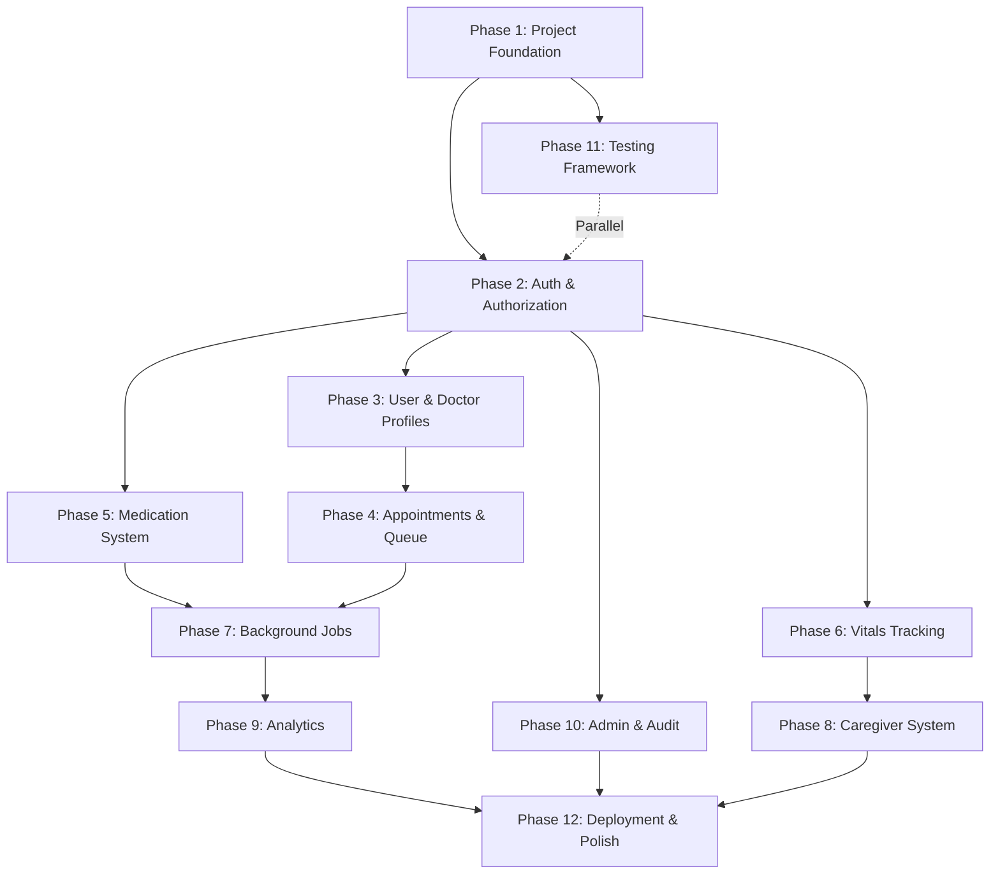

# SmartCare — Implementation Plan

> **Version:** 1.0  
> **Last Updated:** 2026-06-06  
> **Total Estimated Effort:** ~7 Weeks  

---

## Phase Dependency Graph

---

## Phase 1: Project Foundation
**Estimated Effort:** Week 1 (3-4 days)
**Goal:** Setup the core backend infrastructure, database connection, and basic Express middleware stack.

### Files to Create / Modify
- `package.json`, `tsconfig.json`, `.eslintrc.js`, `.prettierrc`
- `docker-compose.yml` (PostgreSQL + Redis)
- `.env.example`
- `prisma/schema.prisma` (Full schema from design doc)
- `prisma/seed.ts` (Admin, Doctor, Patient seed data)
- `src/app.ts`, `src/server.ts`
- `src/config/index.ts`, `src/config/env.ts` (Zod validation)
- `src/utils/logger.ts` (Pino)
- `src/utils/ApiError.ts`, `src/utils/ApiResponse.ts`, `src/utils/asyncHandler.ts`
- `src/middleware/errorHandler.ts`, `src/middleware/notFound.ts`
- `src/routes/health.routes.ts`

### Acceptance Criteria
- [x] `npm run dev` starts the Express server successfully.
- [x] `docker-compose up -d` starts PostgreSQL and Redis.
- [x] `npx prisma db push` and `npx prisma db seed` run without errors.
- [x] `GET /api/v1/health` returns 200 OK.
- [x] Missing environment variables cause the app to crash on startup with a descriptive error.
- [x] Unhandled routes return a standardized 404 JSON response.

---

## Phase 2: Authentication & Authorization
**Estimated Effort:** Week 1-2 (3-4 days)
**Goal:** Implement JWT-based auth, password hashing, and role-based access control (RBAC).

### Files to Create / Modify
- `src/types/express.d.ts`, `src/types/auth.types.ts`
- `src/middleware/auth.ts`, `src/middleware/rbac.ts`, `src/middleware/validate.ts`
- `src/validators/auth.validator.ts`
- `src/services/auth.service.ts`, `src/services/token.service.ts`
- `src/controllers/auth.controller.ts`
- `src/routes/auth.routes.ts`

### Acceptance Criteria
- [x] Users can register with hashed passwords.
- [x] Users can login and receive short-lived access tokens and long-lived refresh tokens.
- [x] Refresh tokens can be exchanged for new access tokens (rotation).
- [x] Auth middleware correctly rejects requests with missing/invalid access tokens.
- [x] RBAC middleware correctly rejects requests from unauthorized roles.
- [x] Request bodies are validated against Zod schemas.

---

## Phase 3: User & Doctor Profiles
**Estimated Effort:** Week 2 (2-3 days)
**Goal:** Build CRUD for users and doctor profiles, including doctor availability slots.

### Files to Create / Modify
- `src/validators/user.validator.ts`, `src/validators/doctor.validator.ts`
- `src/services/user.service.ts`, `src/services/doctor.service.ts`
- `src/controllers/user.controller.ts`, `src/controllers/doctor.controller.ts`
- `src/routes/user.routes.ts`, `src/routes/doctor.routes.ts`

### Acceptance Criteria
- [x] Admin can view, update, and soft-delete users.
- [x] Patients can view doctor profiles.
- [x] Doctors can update their own profile and consultation fees.
- [x] Doctors can set their weekly availability slots.
- [x] Availability slots validate that `startTime` is before `endTime`.

---

## Phase 4: Appointments & Queue System
**Estimated Effort:** Week 2-3 (4-5 days)
**Goal:** Core logic for booking slots, generating queue tokens, and realtime queue management via Socket.IO.

### Files to Create / Modify
- `src/lib/socket.ts`
- `src/validators/appointment.validator.ts`, `src/validators/queue.validator.ts`
- `src/services/appointment.service.ts`, `src/services/queue.service.ts`
- `src/controllers/appointment.controller.ts`, `src/controllers/queue.controller.ts`
- `src/routes/appointment.routes.ts`, `src/routes/queue.routes.ts`

### Acceptance Criteria
- [x] Patients can book appointments only within valid doctor availability slots.
- [x] Booking an appointment generates a sequential `QueueToken`.
- [x] Socket.IO server authenticates connections using JWTs.
- [x] Doctors can call, complete, or skip patients in the queue.
- [x] Queue state changes are broadcast to connected clients in the doctor's Socket.IO room.
- [x] Wait times are correctly estimated.

---

## Phase 5: Medication System
**Estimated Effort:** Week 3-4 (3-4 days)
**Goal:** Allow patients to add recurring medicine schedules and log doses.

### Files to Create / Modify
- `src/validators/medicine.validator.ts`, `src/validators/medicationLog.validator.ts`
- `src/services/medicine.service.ts`, `src/services/medicationLog.service.ts`
- `src/controllers/medicine.controller.ts`, `src/controllers/medicationLog.controller.ts`
- `src/routes/medicine.routes.ts`, `src/routes/medicationLog.routes.ts`

### Acceptance Criteria
- [x] Patients can create recurring medicine schedules.
- [x] Initial medication logs are generated based on timings.
- [x] Patients can mark a dose as taken, skipped, or snoozed.
- [x] Idempotency is handled (clicking "taken" twice on the same log).
- [x] Soft-deleting a medicine cancels its future logs.

---

## Phase 6: Vitals Tracking
**Estimated Effort:** Week 4 (2-3 days)
**Goal:** Track blood pressure, glucose, pulse, and weight.

### Files to Create / Modify
- `src/validators/vital.validator.ts`
- `src/services/vital.service.ts`
- `src/controllers/vital.controller.ts`
- `src/routes/vital.routes.ts`

### Acceptance Criteria
- [x] Patients can record vitals.
- [x] Zod validation enforces correct units and plausible ranges (e.g., systolic BP between 60-300).
- [x] Patients can view a paginated history of their vitals.
- [x] The "latest vitals" endpoint aggregates the most recent reading for each type.

---

## Phase 7: Background Jobs & Notifications
**Estimated Effort:** Week 5 (4-5 days)
**Goal:** Set up Redis, BullMQ, and cron jobs for reminders and log generation.

### Files to Create / Modify
- `src/lib/redis.ts`
- `src/jobs/cron.ts`
- `src/jobs/logGeneration.worker.ts`
- `src/jobs/reminder.worker.ts`
- `src/services/notification.service.ts`
- `src/controllers/notification.controller.ts`
- `src/routes/notification.routes.ts`

### Acceptance Criteria
- [x] Daily cron job generates medication logs for the next 7 days for active medicines.
- [x] Medication reminder job queues notifications 5 minutes before scheduled times.
- [x] Notifications are stored in the DB and emitted via Socket.IO to the user's room.
- [x] Users can fetch their notifications and mark them as read.

---

## Phase 8: Caregiver System
**Estimated Effort:** Week 5 (2-3 days)
**Goal:** Allow linking patients to caregivers with specific permissions.

### Files to Create / Modify
- `src/validators/caregiver.validator.ts`
- `src/services/caregiver.service.ts`
- `src/controllers/caregiver.controller.ts`
- `src/routes/caregiver.routes.ts`

### Acceptance Criteria
- [x] Patient can link an existing caregiver user by email.
- [x] Patient can specify relationship (e.g., Parent, Spouse) and granular permissions (`VIEW_VITALS`, `VIEW_MEDICATIONS`).
- [x] Patient can see a list of linked caregivers and their status.
- [x] Patient can easily revoke access (soft delete the link).
- [x] Abnormal vitals trigger an escalation notification to caregivers with the `RECEIVE_ALERTS` permission.

---

## Phase 9: Analytics
**Estimated Effort:** Week 6 (3-4 days)
**Goal:** Role-based dashboards, adherence tracking, and Redis caching.

### Files to Create / Modify
- `src/config/cache.ts`
- `src/services/analytics.service.ts`
- `src/controllers/analytics.controller.ts`
- `src/routes/analytics.routes.ts`
- `src/jobs/precomputeAnalytics.job.ts`

### Acceptance Criteria
- [x] Patient dashboard returns today's adherence and next appointment.
- [x] Doctor dashboard returns queue stats and completion rates.
- [x] Medication adherence endpoint returns accurate percentages and streaks.
- [x] Heavy aggregation queries are precomputed nightly by a BullMQ job and cached in Redis.

---

## Phase 10: Admin & Audit
**Estimated Effort:** Week 6 (2-3 days)
**Goal:** Admin dashboard and immutable audit logs.

### Files to Create / Modify
- `src/middleware/auditLog.ts`
- `src/services/admin.service.ts`
- `src/controllers/admin.controller.ts`
- `src/routes/admin.routes.ts`

### Acceptance Criteria
- [x] All `POST`, `PUT`, `PATCH`, `DELETE` requests generate an audit log entry via middleware.
- [x] Admins can view system-wide stats (total users, total appointments).
- [x] Admins can query and filter the audit log table.

---

## Phase 11: Testing Framework
**Estimated Effort:** Week 7 (Ongoing throughout development)
**Goal:** Ensure reliability through unit and integration tests.

### Files to Create / Modify
- `jest.config.ts`, `tests/setup.ts`
- `tests/helpers/testDb.ts`, `tests/helpers/testAuth.ts`
- `tests/unit/services/auth.service.test.ts`
- `tests/integration/auth.test.ts`, `tests/integration/appointments.test.ts`

### Acceptance Criteria
- [x] Jest is configured for TypeScript.
- [x] Integration tests run against a separate test database.
- [x] Critical paths (Login, Book Appointment, Mark Med Taken) have passing tests.

---

---

## Phase 13: Medical Records & S3 Integration
**Estimated Effort:** Week 8 (2 days)
**Goal:** Allow patients to upload and manage medical records using AWS S3.

### Files to Create / Modify
- `src/services/s3.service.ts`
- `src/services/medicalRecord.service.ts`
- `src/controllers/medicalRecord.controller.ts`
- `src/routes/medicalRecord.routes.ts`

### Acceptance Criteria
- [x] Patients can upload medical records to S3.
- [x] Multer middleware handles memory storage and size limits.
- [x] Patients can retrieve and delete their medical records.

---

## Phase 14: Payment Integration
**Estimated Effort:** Week 8 (3 days)
**Goal:** Integrate Cashfree payments for appointments.

### Files to Create / Modify
- `src/services/payment.service.ts`
- `src/controllers/payment.controller.ts`
- `src/routes/payment.routes.ts`

### Acceptance Criteria
- [x] Patients can create payment orders for appointments.
- [x] Webhook/verification endpoint verifies Cashfree payment status.

---

## Phase 12: Deployment & Polish
**Estimated Effort:** Week 7 (3-4 days)
**Goal:** Prepare the application for production deployment on Render.

### Files to Create / Modify
- `Dockerfile`
- `docker-compose.prod.yml`
- `.github/workflows/ci.yml` (GitHub Actions CI)
- `README.md`
- `src/config/swagger.ts` (OpenAPI Spec generation)

### Acceptance Criteria
- [x] The app builds successfully into a Docker container.
- [x] CI pipeline runs lint, typecheck, and tests on push.
- [x] Comprehensive README includes setup instructions and architecture overview.
- [x] (Stretch) Swagger UI is available at `/api/docs`.
